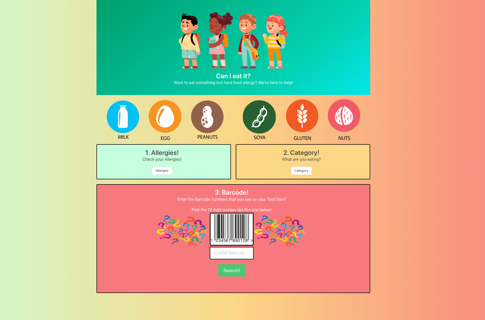

## Can I Eat It?

A kid-friendly web application that allows kids to check if a food item is safe for their allergies before consumption and suggests alternatives if not.

## User Story
AS a young student who has a food allergy.
I WANT to quickly verify a food item I want to eat, or buy is safe for my allergy.
SO THAT I can avoid allergic reactions that may be fatal to my health.

---

## Contributors
Front-End Team
Nick Pettis 
John Edwards

Back-End Team
Hoang Nguyen
Jonathan Echevarria

## Languages used
*HTML
*CSS with Bulma Framework
*JavaScript (jQuery)

## Features
The website features the following:
* Allergy data using the Edamam Food Database API
* User input fields for food item (UPC)
* Alternative foods in snack and drink categories
* Search history using local storage
* Dynamically updated HTML and CSS powered by JQuery
* Clean user interface
